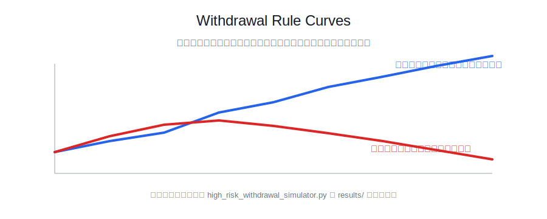
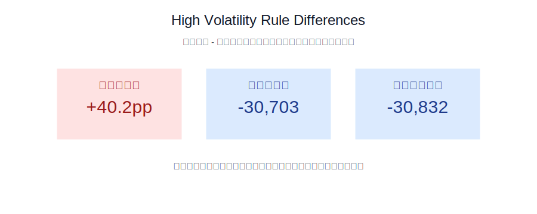

# 高风险交易账户出金模拟器：新高出半 vs 盈利出半

## 1. 一句话结论

在高波动策略里，**“新高出半”更适合作为主规则**：它只在账户真正突破历史权益高点后提取新增利润的一半，因此更能保留保证金缓冲和复利空间；“盈利出半”更像激进落袋规则，现金回收更快，但会更早削薄账户权益，遇到连续亏损时更容易把交易账户推向爆仓线。

本次蒙特卡洛矩阵中，“盈利出半”的累计出金中位数高于“新高出半”的场景占比为 **41.7%**；但它的爆仓概率更高的场景占比为 **88.9%**，期末总财富更高的场景占比只有 **41.7%**。在更接近高波动策略的低胜率、高盈亏比组合中，“盈利出半”爆仓概率更高的占比为 **100.0%**，累计出金更高的占比为 **37.5%**。

## 2. 模拟设定

- 初始交易账户：`10,000`
- 单笔风险：账户权益的 `18%`
- 爆仓线：初始本金的 `25%`，即 `2,500`
- 每组场景：`2,000` 条路径，单路径 `300` 笔交易
- 胜率矩阵：`35% / 45% / 55%`
- 盈亏比矩阵：`1.2R / 2.0R / 3.0R`
- 连续回撤压力：无强制连亏、前期 6 连亏、中段 8 连亏、后段 10 连亏
- 资金口径：`账户资金` 指仍在交易账户内的权益；`总财富` 指交易账户权益加已出金现金。

## 3. 两套规则定义

- **新高出半**：账户权益突破上一次历史高水位时，只提取“突破部分”的 50%；高水位按出金前的权益记录。它的特点是出金慢，但给账户留下更厚的抗波动垫。
- **盈利出半**：每一笔盈利交易结束后，直接提取该笔盈利的 50%；亏损交易不出金。它的特点是出金频繁，但会降低后续交易账户规模。

## 4. 核心对比

下表里的差值均为 `盈利出半 - 新高出半`。爆仓概率差为正，表示“盈利出半”爆仓更多；累计出金差为正，表示“盈利出半”落袋更多。

| 胜率 | 盈亏比 | 爆仓概率差 | 累计出金差 | 总财富差 |
| --- | --- | --- | --- | --- |
| 35% | 1.2R | +0.0pp | +1,888 | +1,888 |
| 35% | 2.0R | +1.2pp | +3,132 | +3,132 |
| 35% | 3.0R | +41.8pp | -29,790 | -29,790 |
| 45% | 1.2R | +1.1pp | +3,937 | +3,937 |
| 45% | 2.0R | +67.9pp | -1,664,107 | -2,969,564 |
| 45% | 3.0R | +63.3pp | -210,424,812,187 | -547,809,155,200 |
| 55% | 1.2R | +68.0pp | -202,040 | -379,249 |
| 55% | 2.0R | +57.4pp | -64,862,827,935 | -173,534,751,255 |
| 55% | 3.0R | +5.6pp | -96,472,870,748,041,600 | -239,510,609,102,444,480 |

## 5. 代表性场景明细

| 胜率 | 盈亏比 | 压力场景 | 规则 | 爆仓概率 | 中位累计出金 | 中位期末总财富 | 中位账户最大回撤 | 中位总财富最大回撤 |
| --- | --- | --- | --- | --- | --- | --- | --- | --- |
| 35% | 3.0R | 无强制连亏 | 新高出半 | 58.2% | 42,686 | 42,686 | -100.0% | -68.2% |
| 35% | 3.0R | 无强制连亏 | 盈利出半 | 100.0% | 12,897 | 12,897 | -100.0% | -46.5% |
| 45% | 2.0R | 无强制连亏 | 新高出半 | 32.0% | 1,679,295 | 2,984,752 | -94.8% | -64.2% |
| 45% | 2.0R | 无强制连亏 | 盈利出半 | 100.0% | 15,188 | 15,188 | -100.0% | -42.8% |
| 55% | 1.2R | 无强制连亏 | 新高出半 | 31.9% | 215,632 | 392,842 | -91.8% | -63.5% |
| 55% | 1.2R | 无强制连亏 | 盈利出半 | 100.0% | 13,592 | 13,592 | -100.0% | -40.1% |

## 6. 资金曲线

## 7. 对高波动策略的判断

高波动策略通常有三个特征：低到中等胜率、较高盈亏比、收益主要来自少数大赢、亏损经常成串出现。因此，出金规则不能只看“赚了就拿走”，还要看它是否会破坏账户承受下一段回撤的能力。

本次模拟显示，在低胜率/高盈亏比组合中，`盈利出半 - 新高出半` 的中位差值为：

- 爆仓概率差：**+40.2pp**
- 累计出金差：**-30,703**
- 期末总财富差：**-30,832**

在强制连续亏损压力场景中，`盈利出半 - 新高出半` 的中位差值为：

- 爆仓概率差：**+31.4pp**
- 累计出金差：**-31,617**
- 期末总财富差：**-31,874**

所以结论不是“盈利出半不好”，而是它更适合目标明确的提款型账户：赚到钱就尽快转移风险，接受交易账户寿命变短。若目标是让高波动策略长期运行、等待少数大行情兑现，**新高出半更稳健**。

## 8. 实务建议

- 主规则采用 **新高出半**，尤其适合胜率 35%-45%、盈亏比 2R-3R 的趋势/突破类策略。
- 若账户已经完成本金回收，可叠加温和版“盈利出半”，例如只对超过历史高水位后的盈利执行，而不是每笔盈利都执行。
- 连续亏损阈值应与出金规则绑定：出现 6-8 连亏后，优先降风险或暂停，而不是继续按原风险比例交易。
- 不建议把“盈利出半”作为唯一规则用于高波动策略；它会提高现金回收速度，但也更容易让账户在下一段波动中失去续航。
